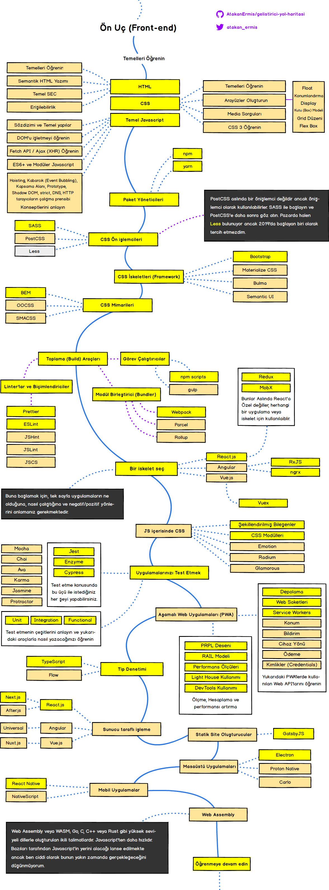
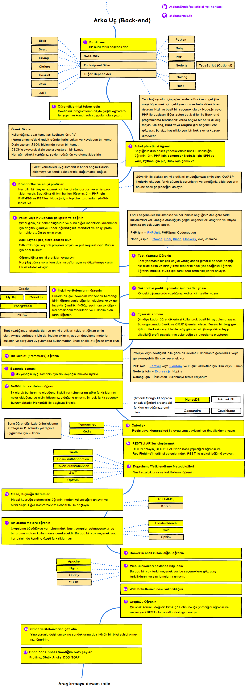
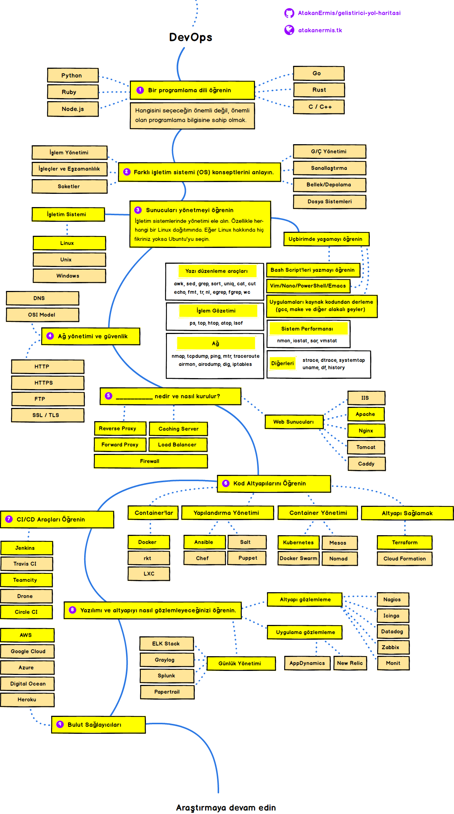

  
  <h2 align="center">Geliştirici Yol Haritası</h2>
  
2019'da web geliştirici olmanın yol haritası.

  
<a href="https://github.com/kamranahmedse/developer-roadmap">Kamran Ahmed'in geliştirici yol haritası</a>ndan birebir çeviridir.

   

Aşağıda Ön Uç (Front-end), Arka Uç (Back-end) ve Devops geliştirici olmak için öğrenmeniz gereken teknolojileri açıklayan tablolar göreceksiniz. Bu tablolar eski bir profesör olan Kamran Ahmed tarafından topluluğa yardımcı olmak için hazırlanmış ve benim tarafımdan birebir çevirilmiştir.

## Uyarı
> Bu yol haritalarının amacı ne öğreneceğinize dair kafanızda fikir oluşması ve trend olan teknolojiler arasında ne öğrenmeniz gerektiğini açıklamaktır. Siz hangi aracın hangi durumlarda daha uygun olduğunu kendiniz öğrenmelisiniz. "trend" kelimesi asla iş için en uygunu anlamına gelmemektedir.

## Giriş

## Frontend Roadmap

## Back-end Roadmap

## DevOps Roadmap

## 🚦 Wrap Up

If you think any of the roadmaps can be improved, please do open a PR with any updates and submit any issues. Also, I will continue to improve this, so you might want to watch/star this repository to revisit.

## 🙌 Destek Olun

> Yol haritalarını nasıl güncelleyeceğinizi öğrenmek için [Katkı dokümanı](./contributing.md)'na göz atabilirsiniz.

- Geliştirmeler için Pull Request açın.
- Issues sekmesinde fikirlerinizi tartışın.
- Diğer insanlara da yayın.
- Herhangi bir geribildirim için [Bana](https://twitter.com/kamranahmedse) veya [Kamran Ahmed'e](https://twitter.com/kamranahmedse) yazın.

## License

