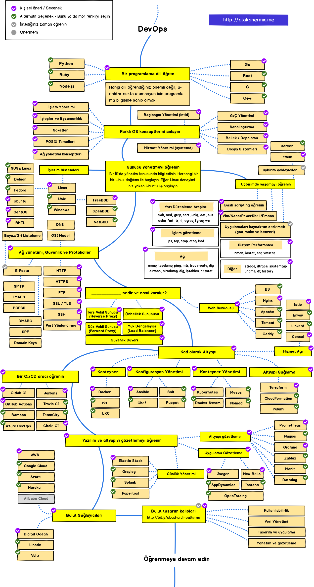

> 2020'de Web geliştirici olmanın yol haritası
> [Orijinal Doküman için tıklayın.](https://github.com/kamranahmedse/developer-roadmap)

Aşağıda Ön Uç (Front-end), Arka Uç (Back-end) ve Devops geliştirici olmak için öğrenmeniz gereken teknolojileri açıklayan tablolar göreceksiniz. Bu tablolar Kamran Ahmed'in "Web Developer Roadmap" dokümanından birebir çevirilmiştir.

## Uyarı
> Bu yol haritalarının amacı ne öğreneceğinize dair kafanızda fikir oluşması ve trend olan teknolojiler arasında ne öğrenmeniz gerektiğini açıklamaktır. Siz hangi aracın hangi durumlarda daha uygun olduğunu kendiniz öğrenmelisiniz. "trend" kelimesi asla iş için en uygunu anlamına gelmemektedir.

## Giriş

## Ön Uç (Front-end) Yol Haritası

## Arka Uç (Back-end) Yol Haritası

## DevOps Yol Haritası

## 🚦 Son Olarak

Eğer yol haritalarının daha fazla geliştirilebileceğini düşünüyorsanız lütfen güncellemeler için PR açın ve sorunları Issues sekmesi altında bildirin. Ayrıca ben de geliştiriyor olacağım, dolayısıyla bu repo'yu tekrar ziyaret etmek üzere izleyebilir/yıldızlayabilirsiniz.

## 🙌 Destek Olun

> Yol haritalarını nasıl güncelleyeceğinizi öğrenmek için [Katkı dokümanı](./contributing.md)'na göz atabilirsiniz.

- Geliştirmeler için Pull Request açın.
- Issues sekmesinde fikirlerinizi tartışın.
- Projeyi diğer insanlara da yayın.
- Herhangi bir geribildirim için [Bana](https://twitter.com/atakan_ermis) veya [Kamran Ahmed'e](https://twitter.com/kamranahmedse) yazın.

## Lisans

Bu içerik, Creative Commons Atıf-Gayriticari-AynıLisanslaPaylaş 4.0 lisansıyla korunmaktadır. Lisans hakkında daha fazla bilgiye yukarıdaki bağlantı aracılığıyla erişebilirsiniz.
